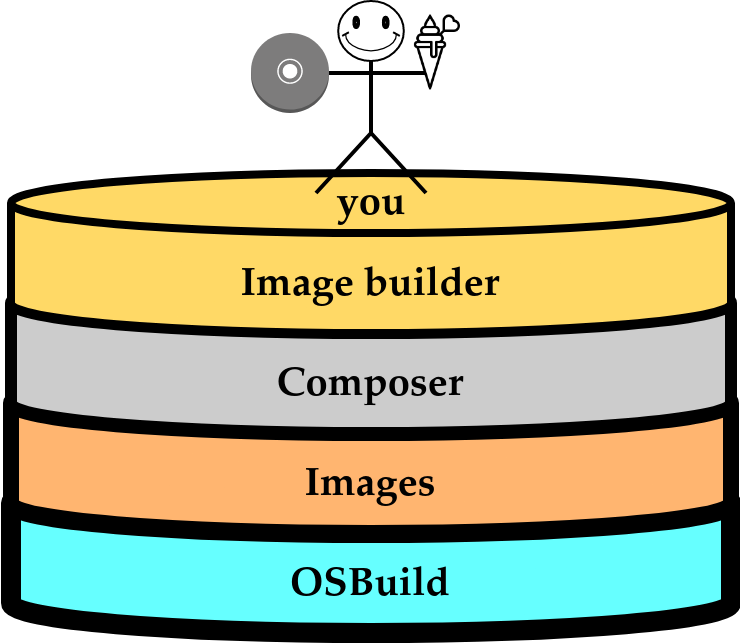

# Image Builder

building up-to-date, customised operating system images

Note:

Hello everyone,

So I will talk a little bit about image builder, also known as osbuild.

I'll talk about how it works, how the stack fits together, but before that I'll try to explain why
it exists.

<!--v-->

## Why?

- Building bootable operating system images isn't **that** hard, but:
  - how to do it consistently and reliably
  - how to do it for different target environments (in a nice way)

- Image based workloads are becoming the norm

Note:

So image builder builds bootable operating system images, base images.

It's not that hard of a problem, you just put a few bits in the right place, most of the hard work
is done by the package maintainers.

But at a certain scale constistency and reliability are important. You want to be able to do this as
part of pipelines obviously. So you need infrastructure, and conceptually you need a clear way to
define images etc...

It's not that hard until you need one for different purposes, different targets, different
architectures, AWS, GCP, Azure, local virtualization, installers. And you don't want to have these
differ too much from one another, so a structured way to define images comes in handy.

Also to avoid vendor lock-in. Now cloud environments often offer their own workflow to build images
for their environment or just offer their own images fullstop, but that might result in vendor
lock-in. So a system that's easy to extend and add another image to, is useful.

Image based workloads are becoming the norm, everybody uses containers. We need to make VM images as
easy to make and use as container images.

<!--v-->

## So, Image builder



Note:

so image builder was created to address these problems.

This is the stack, and I want to walk you through the stack, just to quickly give an idea of what
each component does and why it's there.

<!--s-->

## OSBuild

- Takes as input a manifest
  - Divided into pipelines and stages
- Produces the actual disk images

- The image build happens inside of a buildroot container:
  - one pipeline for the buildroot
  - the rest for the image

<small>let's take a look at a manifest...</small>

<!-- <table style="font-size: 0.5em"> -->
<!--     <tr> -->
<!--         <td rowspan="3"><b>OSBuild</b></td> -->
<!--         <td rowspan="3">Composer</td> -->
<!--         <td>Weldr client (cli)</td> -->
<!--     </tr> -->
<!--     <tr> -->
<!--         <td>Cockpit composer plugin</td> -->
<!--     </tr> -->
<!--     <tr> -->
<!--         <td>Hosted service</td> -->
<!--     </tr> -->
<!-- </table> -->

Note:

todo little architecture diagram

So at the very bottom of the stack we have OSBuild, which is the low level tool that executes a
manifest. The manifest describes what exactly goes into the image, and how to package it.

TODO auditable reproducibility!! not meant to be written by hand
The manifest is an important component, it makes these images auditable, as it describes the exact
packages that go into the image and what (config) bits should be changed, and how it was packaged.

It is mostly distribution agnostic. But supports installing rpm and pacman packages.

- starts from a 'pristine' tree and builds it up piece by piece,


<!-- | OSBuild | Composer | Composer-CLI -->

<!--v-->

### <a href="/manifest.json" target="_blank">OSBuild manifest</a>

<small><small>Caveat: OSBuild isn't aware of what makes up a specific distribution.</small></small>

Note:
The core input of osbuild
Stages, ...

But these would be a pain to write by hand, so there are more high-level ways of describing
images. But first we need to take a look at how we define a specific image. As mentioned before
OSBuild doesn't know what goes into a fedora qcow2, it just executes the steps in the manifest.

<!--s-->

## Image definitions:
- Defines what makes up a specific distribution:
  - Base package sets
  - Default configurations
- Defines how architectures differ
- Defines how the differences between target environments

Note: So we have the images base which is contains all the information needed to describe an image
of a specific distribution of a specific architecture for a specific target environment. It
integrates tightly with Composer,

<!--s-->

## Composer:
- Primary consumer of the image definitions
- user input + repos + image definitions = image
- Orchestrates


Note:

Then we get to composer, composer is really the part that brings it all together. It takes user
input in a format I'll get into shortly, package repositories from either the user or the system,
and the aforementioned image definitons to generate the manifest we discussed earlier.

It also is the component that depsolves, so we start from the base package set, user-requested
packages and then get the dependency tree which is then put into the manifest.

Also orchestrates all the builds, it manages a job queue and workers. Important to run this as a
hosted service which I'll get into after discussing this user input.

<!--v-->

### So what does composer need?
```
{
  "distribution": "fedora-39",
  "image_requests": [
    {
      "architecture": "x86_64",
      "image_type": "qcow2",
      "repositories": [{
        "baseurl": "https://mirrors.fedoraproject.org/metalink?repo=fedora-39&arch=x86_64",
        "rhsm": false
      }, {
        "baseurl": "https://mirrors.fedoraproject.org/metalink?repo=updates-released-f39&arch=x86_64",
        "rhsm": false
      }, {
        "baseurl": "https://mirrors.fedoraproject.org/metalink?repo=fedora-modular-39&arch=x86_64",
        "rhsm": false
      },
      {
        "baseurl": "https://mirrors.fedoraproject.org/metalink?repo=updates-released-modular-f39&arch=x86_64",
        "rhsm": false
      }]
    }
  ],
  "customizations": {
    "packages": ["cockpit"]
  }
}
```

Note:

So composer takes a higher-level object. And as you can see it's a lot simpler than the manifest we
had before.

You just specify the distribution, architecture, image type, and repositories. Customisations are
optional.

<!--s-->

## The fluff on top

On how to make this easy

Note:

So now I want to talk a little bit about how to make this even easier, and what's exposed to
end-users.

<!--v-->

### CLI

A blueprint as input:
```toml
name = "second-disk"

[[customizations.files]]
path = "/etc/systemd/system/prepare-data-disk.service"
data = """
[Unit]
Description=Prepare the data disk during the first boot
ConditionPathExists=!/var/lib/prepare-data-disk-first-boot

[Service]
Type=oneshot
ExecStart=mkfs.ext4 /dev/sdb
ExecStart=mkdir /mnt/data
ExecStart=mount /dev/sdb /mnt/data
ExecStart=bash -c "echo '/dev/sdb /mnt/data ext4 defaults 0 2' >>/etc/fstab"
ExecStartPost=touch /var/lib/prepare-data-disk-first-boot

[Install]
WantedBy=default.target
"""

[customizations.services]
enabled = ["prepare-data-disk"]

[[customizations.user]]
name = "user"
groups = ["wheel"]
key = "ssh-ed25519 AAAAC3NzaC1lZDI1NTE5AAAAIPB1jFl4p6FTBixHT6wOk6X8nj/Z7eoPNQE/M0wK485K ondrej@budai.cz"
```
<small>sourced from https://budai.cz/posts/2023-07-18-first-boot-automation-in-image-builder/</small>


Note:

There's the composer-cli which takes a blueprint as input. And here's a blueprint with more
customizations.

<!--v-->

### CLI

```bash
# Push the blueprint
$ composer-cli blueprints push second-disk.toml

# Start a qcow2 build
$ composer-cli compose start second-disk qcow2
Compose 14107a91-edbd-419b-820a-cb813f8063d6 added to the queue

# Wait for the build to finish
$ composer-cli compose list | grep 14107a91-edbd-419b-820a-cb813f8063d6
14107a91-edbd-419b-820a-cb813f8063d6   RUNNING    second-disk   0.0.1     qcow2

# ...
$ composer-cli compose list | grep 14107a91-edbd-419b-820a-cb813f8063d6
14107a91-edbd-419b-820a-cb813f8063d6   FINISHED   second-disk   0.0.1     qcow2

# Download the image
$ composer-cli compose image 14107a91-edbd-419b-820a-cb813f8063d6 --filename image.qcow2
```
<small>sourced from https://budai.cz/posts/2023-07-18-first-boot-automation-in-image-builder/</small>


Note: This is how you would invoke it, the repositories and distribution are inferred from the host.

<!--v-->

### <a href="https://localhost:9091/composer" target="_blank">Cockpit composer</a>

Note:

<!--v-->

### Fedora hosted service!

https://console.stg.fedorainfracloud.org


| supported ✅ | soon™ |
| --- | --- |
|<table><tr><td>KVM (qcow2)</td></tr><tr><td>vSphere (ova or vmdk)</td></tr><tr><td>AWS (ami)</td></tr></table>| <table><tr><td>installer (ISO)</td></tr><tr><td>Google cloud</td></tr><tr><td>live-installer</td></tr><tr><td>Azure</td></tr><tr><td>WSL (tar)</td></tr><tr><td>WSL (tar)</td></tr><tr><td>container (tar)</td></tr><tr><td>IOT</td></tr></table>|

Note:

Currently supported, soon we'll added

For now only x86

<!--v-->

Demo:

```json
{
  "distribution": "fedora-38",
  "image_requests": [
    {
      "architecture": "x86_64",
      "image_type": "guest-image",
      "upload_request": {
        "type": "aws.s3",
        "options": {}
      }
    }
  ],
  "customizations": {
    "packages": [
      "cockpit",
      "cockpit-networkmanager",
      "firewalld",
      "npm"
    ],
    "files": [{
      "path": "/root/startup.sh",
      "data": "npm install -g reveal-md\ndnf install -y demo-slides\ncd /root\nreveal-md --theme solarized --host 0.0.0.0 ./slides.md",
      "mode": "0755"
    },{
      "path": "/etc/systemd/system/reveal-md.service",
      "data": "[Unit]\nAfter=network.target\n[Service]\nType=oneshot\nExecStart=bash /root/startup.sh\n[Install]\nWantedBy=default.target\n"
    }],
    "services": {
      "enabled": ["cockpit.socket", "reveal-md"]
    },
    "firewall": {
      "ports": ["1948:tcp"],
      "services": {
        "enabled": ["cockpit"]
      }
    },
    "custom_repositories": [
      {
        "id": "demo-copr",
        "baseurl": ["https://download.copr.fedorainfracloud.org/results/gundersanne/demo-rpm/fedora-$releasever-$basearch/"],
        "check_gpg": false,
        "check_repo_gpg": false,
        "rhsm": false
      }
    ]
  }
}
```
<small>https://id.stg.fedoraproject.org/openidc/Authorization?scope=openid&client_id=consolerhc-cli&redirect_uri=urn:ietf:wg:oauth:2.0:oob&response_type=token&nonce=foo</small>

Note:

So this also runs as a hosted service which is what I really wanted to show off today.

So now i'll give a demo, this is what a more complex request could look like.

Auth:
https://id.stg.fedoraproject.org/openidc/Authorization?scope=openid&client_id=consolerhc-cli&redirect_uri=urn:ietf:wg:oauth:2.0:oob&response_type=token&nonce=foo

OFFSCREEN!!
Put it in a file or variable


curl -H "content-type: application/json" -H "Authorization: Bearer $AT" https://console.stg.fedorainfracloud.org/api/image-builder/v1/composes | jq


curl -d@/home/sanne/workstuff/fosdem/slides/request.json -H"content-type: application/json" -H "Authorization: Bearer $AT" https://console.stg.fedorainfracloud.org/api/image-builder/v1/compose | jq


curl -H "content-type: application/json" -H "Authorization: Bearer $AT"
https://console.stg.fedorainfracloud.org/api/image-builder/v1/composes/$CID
| jq


<!--v-->

### Demo

<details>
<summary>running the image</summary>

```
#!/bin/bash
qemu-system-x86_64 \
    -m 4096 \
    -nographic \
    -enable-kvm \
    -cdrom cloud-init.iso \
    -cpu max \
    -net nic,model=virtio \
    -net user,hostfwd=tcp::9093-:9090,hostfwd=tcp::1949-:1948 \
    composer-api.qcow2
```

</details>
<br/>

- <a href="https://localhost:9093" target="_blank">cockpit</a>
- <a href="http://localhost:1949/slides.md" target="_blank">http://localhost:1949/slides.md</a>

Note:
Service
embed the slides inside of the image, and start over

Fedora service!

<!--s-->

### Find us at

- https://osbuild.org/
- https://matrix.to/#/#image-builder:fedoraproject.org
- https://github.com/osbuild/

Note:
So here are the links to find us.

So what's the goal here,

So one is to make your infrastructure to build images a lot more manageable.

The other is to make building images a lot easier for end users, like people throw around containers
ib makes it easier to do the same with vm images. There are advantages to working image based.


https://budai.cz/posts/2023-07-18-first-boot-automation-in-image-builder
